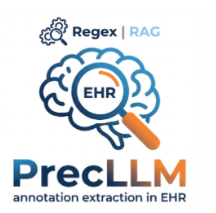
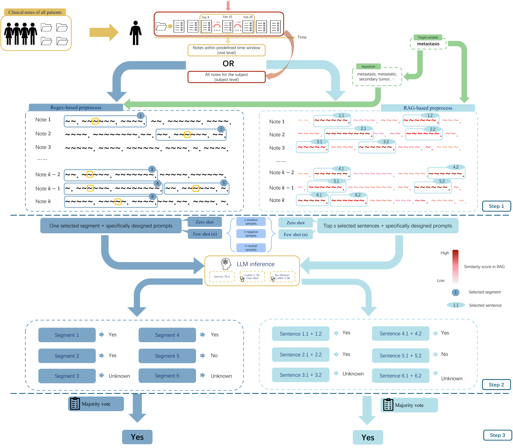

# LLM-EHR: Clinical Phenotyping with Large Language Models

<p align="center">
    
</p>


## overview

This repository accompanies the PrecLLM study and provides an end-to-end implementation for privacy-preserving clinical annotation extraction from unstructured EHRs. We evaluate three phenotypes (metastasis, insulin use, hypertension) across a private HNC cohort and MIMIC-IV, and report subject-level and visit-level performance using both model-level and system-level sensitivity.

For public sharing, the example below starts from SUM-level CSVs (no note IDs) because raw clinical notes cannot be released.

## Structure
<p align="center">
    
</p>

```
LLM_Note/
├── fine_tune/                    # Fine-tuning pipeline
│   ├── 01_load_data.py           # Data loading and preprocessing
│   ├── 02_model_finetuning.py    # QLoRA fine-tuning implementation
│   └── 03_classification.py      # Model inference and classification
│
└── Context_learning/             # In-context learning experiments
    ├── Process/                  # Text preprocessing pipelines
    │   ├── Subset/
    │   │   ├── P00_generate_subset.py    # Dataset subset generation
    │   │   ├── P01_extract_notes.py      # Clinical note extraction
    │   │   ├── P02_RAGsentence.py        # RAG-based text extraction
    │   │   └── P02_regex.py              # Regex-based text extraction
    │   └── Metastasis_all/               # Full metastasis dataset processing
    │
    └── Predict/                  # Classification experiments by model
        ├── Gemma_7b/             # Gemma-7B experiments
        ├── Llema2_7b/            # Llama2-7B experiments
        ├── Llema3_8b/            # Llama3-8B experiments
        └── Llema3_70b/           # Llama3-70B experiments
```

## Procedure

### Step 1: Preprocess Clinical Notes (Regex or RAG)

Extract relevant sentences from discharge summaries using semantic similarity:

```bash
# Use RAG (Retrieval-Augmented Generation) to extract sentences related to metastasis
# This creates: /subset_data/filtered_2sen_discharge_notes_metastasis.csv
python Context_learning/Process/Subset/P02_RAGsentence.py metastasis
```

**What this does:**
- Extracts short, phenotype-relevant text segments from each note.
- Writes a filtered dataset with the `EXTRACTED_TEXT` column.

#### Step 2: Run Classification with In-Context Learning

Execute the Gemma-7B model with 3-shot learning:
```bash
# Example with a fixed seed
seed=100
python Context_learning/Predict/Gemma_7b/Metastasis/A_metastasis_rag_3shot.py --seed $seed
```

**What this does:**
- Runs the LLM on the preprocessed text and outputs class predictions.
- Saves predictions to the results folder for downstream aggregation.

### Alternative Configurations

Set a seed once:

```bash
seed=100
```

**Different preprocessing strategies:**
```bash
# No preprocessing (full discharge summary)
python Context_learning/Predict/Gemma_7b/Metastasis/A_metastasis_nonprocess_3shot.py --seed $seed

# Regex-based extraction (keyword matching)
python Context_learning/Predict/Gemma_7b/Metastasis/A_metastasis_regex_3shot.py --seed $seed
```

**Different few-shot settings:**
```bash
# 0-shot learning (minimal examples)
python Context_learning/Predict/Gemma_7b/Metastasis/A_metastasis_rag_0shot.py --seed $seed

# 6-shot learning (maximum examples)
python Context_learning/Predict/Gemma_7b/Metastasis/A_metastasis_rag_6shot.py --seed $seed
```

**Different models:**
```bash
# LLaMA-2-7B-Chat-Med
python Context_learning/Predict/Llema2_7b/Metastasis/A_metastasis_rag_3shot.py --seed $seed

# Bio-Medical-LLaMA-3-8B
python Context_learning/Predict/Llema3_8b/Metastasis/A_metastasis_rag_3shot.py --seed $seed

# Meta-Llama-3-70B-Instruct
python Context_learning/Predict/Llema3_70b/Metastasis/A_metastasis_rag_3shot.py --seed $seed
```

## Step 3: Summary subset (optional)

For creating balanced subsets for pilot studies:

```bash
# Generate stratified subset from full MIMIC-IV dataset
# Creates subset with balanced class distributions
python Context_learning/Process/Subset/P00_generate_subset.py
```

## Fine-Tuning Pipeline (QLoRA)

For fine-tuning experiments with parameter-efficient adaptation:

#### Step 1: Load and Prepare Training Data
```bash
# Load MIMIC-IV discharge summaries and create train/validation splits
# Balances classes and formats data for instruction tuning
python fine_tune/01_load_data.py
```


#### Step 2: Fine-Tune Model with QLoRA
```bash
# Fine-tune Gemma-7B using QLoRA (4-bit quantization + LoRA adapters)
# Training time: ~2-4 hours on a single A100 GPU
python fine_tune/02_model_finetuning.py
```


#### Step 3: Run Inference with Fine-Tuned Model
```bash
# Classify test set using fine-tuned model
# Output: classification results with predictions
python fine_tune/03_classification.py
```

## Subject-level SUM to figures (no PHI)

This example reproduces the two subject-level sensitivity figures (model and system) starting from SUM CSVs. It is intended as a minimal, shareable chain that skips raw notes.

```bash
python Context_learning/Summary/scripts/aggregate_subject_summaries.py
Rscript Context_learning/Summary/scripts/plot_subject_model_sensitivity.R
Rscript Context_learning/Summary/scripts/plot_subject_system_sensitivity.R
```

Outputs:

- `Context_learning/Summary/output/model_sensitive_3model_private_subject.pdf`
- `Context_learning/Summary/output/sys_sensitive_3model_private_subject.pdf`

## Batch run examples

Subject-level summaries (all CSVs in a folder):

```bash
bash Context_learning/Summary/scripts/run_batch_subject_summary.sh \
    /home/shilin/temp/LLM_edit/HNC_SUBSET_all/Results/P1_LLM \
    /home/shilin/temp/LLM_edit/HNC_SUBSET_all/Results/P2_sum_subject
```

Time-range summaries (20/30/40 days) using the existing run script:

```bash
bash /home/shilin/temp/LLM_edit/HNC_SUBSET_all/Run/run_P001_summary_all_timeranges.sh
```

## Data

This project uses discharge summaries from the MIMIC-IV database.


