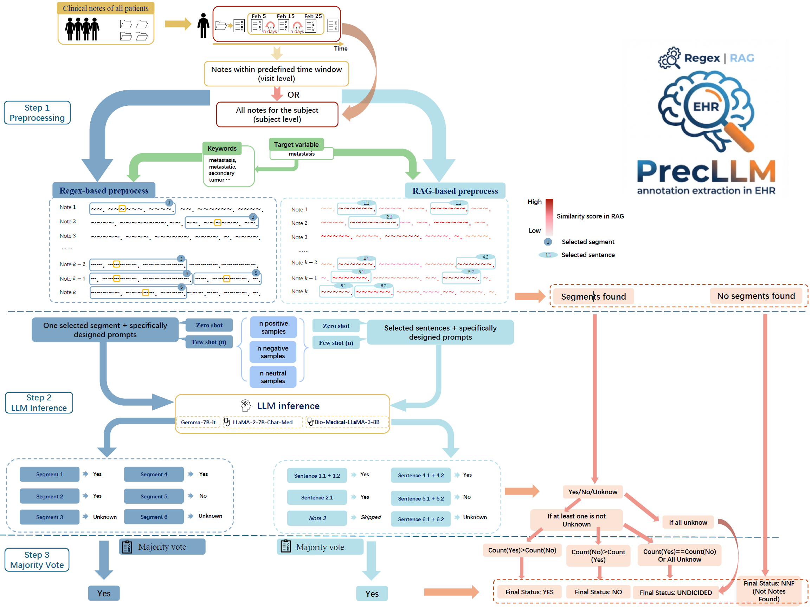

# PrecLLM

<p align="center">
  
</p>

PrecLLM is a  package for our paper-oriented clinical note phenotyping workflows.
It is explicitly designed to preserve the core logic from the original project: preprocessing (`regex/rag/nonprocess`), prompt-controlled inference (`0/3/6-shot`), and model-specific execution.

## Workflow Diagram

<p align="center">
  
</p>

Diagram legend:
- Input: note-level CSV data.
- Preprocess: `regex`, `rag`, or `nonprocess`.
- Prompting: phenotype-specific prompts with `0`, `3`, or `6` shot settings.
- Inference backend: `rule` baseline or `transformers` model inference.
- Outputs: preprocessed CSV, predictions CSV, and manifest JSON.

## What Was Restored and Deepened

- Prompt system is now first-class and explicit.
- Model invocation path is explicit and configurable.
- Multi-ID schema support is explicit (`subject_id`, `hadm_id`, etc.).
- Output preserves source identifiers for audit and downstream merge.

## Prompt System (Core Control)

Prompt source code location:
- `src/precllm/prompting.py`

This module contains:
- phenotype-specific task templates (`metastasis`, `insulin`, `hypertension`)
- shot-aware example selection (`0`, `3`, `6`)
- deterministic prompt rendering (`build_prompt`)

Legacy alignment:
- Example counts follow the original script style:
  - `shot=0` -> 3 examples
  - `shot=3` -> 9 examples
  - `shot=6` -> 18 examples

Inspect a prompt directly:

```bash
python -m precllm prompt \
  --phenotype metastasis \
  --shot 6 \
  --note-text "Patient with known metastatic disease in liver."
```

## Model Invocation

Model backend code location:
- `src/precllm/llm_backends.py`

Prediction orchestration:
- `src/precllm/predict.py`

Supported inference backends:
- `rule`: deterministic baseline (no external LLM dependency)
- `transformers`: Hugging Face model inference via `AutoTokenizer` and `AutoModelForCausalLM`

Install LLM runtime dependencies when using `transformers` backend:

```bash
python -m pip install -e '.[llm]'
```

Default model registry:
- `gemma-7b` -> `google/gemma-7b-it`
- `llama2-7b` -> `lianggq/llama-2-7b-chat-med`
- `llama3-8b` -> `ContactDoctor/Bio-Medical-Llama-3-8B`
- `llama3-70b` -> `meta-llama/Meta-Llama-3-70B-Instruct`

Override model path when needed:
- `--model-path <hf_repo_or_local_path>`

## Data Contract and Schema Flexibility

Minimum required data:
- one text column for clinical notes (`--text-column`)
- one or more ID columns (`--id-column` or `--id-columns`)

Single-ID example:

```bash
python -m precllm run \
  --input-csv your_data.csv \
  --output-dir outputs \
  --model llama2-7b \
  --phenotype metastasis \
  --preprocess rag \
  --shot 3 \
  --id-column note_id \
  --text-column text \
  --inference-backend rule
```

Multi-ID example (`subject_id` + `hadm_id`):

```bash
python -m precllm run \
  --input-csv your_data.csv \
  --output-dir outputs \
  --model llama2-7b \
  --phenotype metastasis \
  --preprocess regex \
  --shot 3 \
  --id-columns subject_id,hadm_id \
  --text-column clinical_note \
  --inference-backend transformers
```

How it is handled:
- all ID columns are validated before run
- IDs are preserved in outputs
- `record_id` is generated as a stable composite key from provided IDs

## CLI Reference

List supported options and defaults:

```bash
python -m precllm catalog
```

Dry-run with full resolved config and prompt metadata:

```bash
python -m precllm run \
  --input-csv examples/sample_input.csv \
  --output-dir outputs \
  --model gemma-7b \
  --phenotype insulin \
  --preprocess rag \
  --shot 0 \
  --id-columns subject_id,hadm_id \
  --text-column text \
  --inference-backend rule \
  --dry-run
```

## Output Contract

Each run generates:
- `<run_stem>.preprocessed.csv`
- `<run_stem>.predictions.csv`
- `<run_stem>.manifest.json`

`<run_stem>` format:
- `{model}_{phenotype}_{preprocess}_{shot}shot_seed{seed}`

The output CSV files include:
- original ID columns
- `record_id`
- prediction fields (`label`, `evidence`, `raw_response`)

## Package Layout

```text
LLM_Note/
- assets/
- examples/
- src/precllm/
- tests/
- pyproject.toml
- README.md
```


## License and Compliance

This project is licensed under the MIT License (`LICENSE`).

Compliance and responsibility notes:
- The package is a research and engineering tool, not a medical device.
- Outputs are for research workflows and must not be used as standalone clinical decisions.
- You are responsible for HIPAA/privacy compliance, data governance, and model access controls in your environment.
